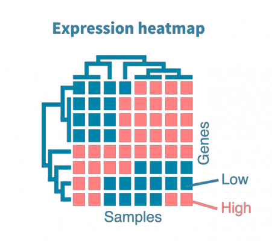

## Data loading and preprocessing

Libraries used in this project:


<!-- this code is silent and will be seen just for us to install the packages-->

```{r installing, echo=FALSE, message=FALSE}
if (!requireNamespace("BiocManager", quietly = TRUE))
    install.packages("BiocManager")

if (!requireNamespace("edgeR", quietly = TRUE)) {
  BiocManager::install("edgeR")
}

if (!requireNamespace("GEOquery", quietly = TRUE)) {
  BiocManager::install("GEOquery")
}

if (!requireNamespace("biomaRt", quietly = TRUE)) {
  BiocManager::install("biomaRt")
}

if (!requireNamespace("pheatmap", quietly = TRUE)) {
  install.packages("pheatmap")
}

if (!requireNamespace("caret", quietly = TRUE)) {
  install.packages("caret")
}

if (!requireNamespace("leaps", quietly = TRUE)) {
  install.packages("leaps")
}
```

Data in this project is accessed from the [GEO database](https://www.ncbi.nlm.nih.gov/geo/). The dataset used is [GSE231409](https://www.ncbi.nlm.nih.gov/geo/query/acc.cgi?acc=GSE231409) which contains RNA-Seq data from 455 patients testing for COVID-19. The data is downloaded from the GEO database and saved as a `.csv` file. The metadata is accessed directly from the GEO database and saved as a data frame via `GEOquery` package. The data is then normalized using the `edgeR` package. The normalized data is then cleaned and preprocessed using `dplyr` and `tibble` packages, and the gene names were accessed from the ENSEMBL accession numbers via `biomaRt` package. The data is then visualized using `ggplot2` package.

**What's the data?**  
The data is a matrix of 455 samples and 60675 genes. The samples are from patients who were tested for COVID-19. It has been experimentally collected and published in the GEO database and it representes RNA-seq raw counts data.  
**What's gene expresion data?**  

Gene expression is the process by which information from a gene is used in the synthesis of a functional gene product. These products are often proteins, but in non-protein coding genes such as transfer RNA (tRNA) or small nuclear RNA (snRNA) genes, the product is a functional RNA. 
RNA-seq is a technique used to measure gene expression levels. It is used to compare gene expression levels between different samples.  [source: Wikipedia](https://en.wikipedia.org/wiki/Gene_expression).  

**Why normalize?**  

The data is normalized to account for the differences and make sure the gene expression levels are comparable between and within samples.[source: BigOmics Analytics](https://bigomics.ch/blog/why-how-normalize-rna-seq-data/)

**Why the project?**  

The project is to explore the data and see if there is a difference in gene expression levels between patients who tested positive for COVID-19 and those who tested negative. In the context of a data mining project, this can be used to identify genes that are differentially expressed between the two groups and can be used as biomarkers for COVID-19. In the classification seeting, we're building a model that can predict whether a patient is positive or negative for COVID-19 based on their gene expression levels.  

<p align="center">
  
  [Genevia Technologies](https://geneviatechnologies.com/bioinformatics-analyses/rna-seq-data-analysis/).
</p>

### Loading the data

The csv file can be accessed and directly downloaded [here](https://www.ncbi.nlm.nih.gov/geo/download/?acc=GSE231409&format=file&file=GSE231409%5FBRAVE%5FRNASeq%5Fcounts%2Ecsv%2Egz). The metadata is accessed directly from the GEO database using the `GEOquery` package on accession number `GSE231409`. It comprises informatio related to samples subjects, ids, tissue, covid status...etc. Out of them all we're interested in taking the sample ids (GSM instead of having titles) and the covid status which is our response y (a case of binary classification, yes/no).


```{r loading, message=FALSE}
library(tidyverse) #data anlaysis
library(GEOquery) #connecion to GEO data
library(biomaRt) #connection to ensembl
library(edgeR) #normalize seq counts
library(pROC) #plot the roc curve
library(caret) #for cv
library(leaps) #for subset selection
library(MASS)


#loading data accessed from GEO
gene_exp <- read.csv("GSE231409_BRAVE_RNASeq_counts.csv")
rownames(gene_exp) <- gene_exp$target_id
gene_exp <- gene_exp %>%
  dplyr::select(-target_id)

#loading the metadata from GEO directly
gse <- getGEO("GSE231409", GSEMatrix =TRUE, getGPL=FALSE)
metadata <- pData(gse[[1]])

get_stat <- function(df) {
  cat("1st 5 columns:", head(colnames(df), n = 5), "\n")
  cat("1st 5 rows:", head(rownames(df), n = 5), "\n")
}
get_sample <- function(df){
  submatrix <- df[1:3, 1:3]
  print(submatrix)
}

##get_stat(gene_exp)
get_sample(gene_exp)
```

### Preprocessing

The data requires some preprocessing before it can be used for analysis. Normalization method follows the TMM [[2]](#references) method (trimmed mean of M values). The data is normalized using the `edgeR` package. :  

- load the data in a `DGEList` object
- filter low-expressed genes
- normalize the expression numbers/counts using TMM


```{r normalization}

dge <- DGEList(counts = gene_exp)

keep <- filterByExpr(dge)
dge <- dge[keep, , keep.lib.sizes = FALSE]
dge <- calcNormFactors(dge, method = "TMM")
normalized_counts <- cpm(dge, normalized.lib.sizes = TRUE)
gene_exp <- as.data.frame(normalized_counts)

#get_stat(gene_exp)
get_sample(gene_exp)

```


After having normalized the data, we wanna select the most useful genes for our analysis, since the number is still huge. This can be done by computing the variance for each gene, the genes with highest variance are most likely to be biomarkes and will be useful features for prediction. Here we chose the top 100 genes as our feature pool, before performing feature selection. This is a common step to perform right after normalization and before mapping the accession numbers to valid gene names (source: lovely people from [bioinformatics exchange](https://bioinformatics.stackexchange.com/questions/4128/select-top-100-genes-ranked-by-variance-in-read-counts))


```{r var_genes}

sel_indices <- order(apply(gene_exp, 1, var), decreasing = TRUE)[1:100]
gene_exp <- gene_exp[sel_indices, , drop = FALSE]
```


Now notice that the gene names are encoded by ENSEMBL accession numbers, we will connect to the database via biomaRt and change them to gene names.  
Steps to follow: 
- get the list of ensembl ids (trimmed the numbers after . since these refer to transcript variants and do all ebling to the same ensembl id, in order to access it properly from the databse had to make it represent a non . number)
- connect to the database
- retrieve the gene names for the ensembl ids
- replace the ensembl ids by gene names in the data frame

**p.s.** when retrieving the gene names, some of the ENSEMBL ids do not link to a gene name, so we remove those rows from the data frame. These can be associated to any of the following:  

- Unannotated Genes
- Novel Genes
- Pseudogenes
- Non-Coding RNAs
- Temporary IDs

In all cases, they won't be useful for our analysis to make inferences so we remove them


```{r accessing_gene_names_ensembl}
#Fixing row names: changing the ensemble accession IDs into meaningful gene names
rownames(gene_exp) <- sub("\\..*", "", rownames(gene_exp)) #removing the .* from the ensemble ids since that dows not affect the gene names
#dont worry about duplicates they will be handled ;)

ensembl_ids <- rownames(gene_exp)
gene_exp <- gene_exp %>% 
  rownames_to_column(var = "ens_accession") %>%
  rename(ensembl_gene_id = ens_accession) #we're in the process of changing the rownames

ensembl <- useEnsembl(biomart = "genes") #choosing the database genes 
connect <- useMart("ensembl", dataset = "hsapiens_gene_ensembl") #building a connection with ensembl to the database for human genes


#att <- listAttributes(connect) #listing the attributes to see which map for ids and names, just exploring around :p
#filters <- listFilters(connect) #listing the filters to see which map for ids and names
#retrieves with filter for the ensemble ids and returns the gene names only for the values that we provide - in this case the ensembl_ids

gene_names <- getBM(attributes = c("ensembl_gene_id","external_gene_name"), 
                    filters ="ensembl_gene_id", 
                    values = ensembl_ids, 
                    mart = connect)
gene_names$ensembl_gene_id <- as.character(gene_names$ensembl_gene_id)
gene_names$external_gene_name <- as.character(gene_names$external_gene_name)


#wanna get the list of ensembl ids that are not in gene_names
ensembl_ids_not_in_gene_names <- setdiff(ensembl_ids, gene_names$ensembl_gene_id)


#join tables and remove the ids that do not map to gene names
gene_exp <- merge(gene_exp, gene_names, by = "ensembl_gene_id", all.x = TRUE)
gene_exp <- gene_exp %>% 
  filter(!is.na(gene_exp$external_gene_name))


#adding a prefix to duplicate external_gene_name
gene_exp <- gene_exp %>%
  mutate(external_gene_name = ifelse(duplicated(external_gene_name), 
                                     paste(external_gene_name, row_number(), sep = "_"), 
                                     external_gene_name))


rownames(gene_exp) <- gene_exp$external_gene_name
gene_exp <- gene_exp[,-1] %>%
  dplyr::select(-external_gene_name)

#get_stat(gene_exp)
get_sample(gene_exp)

```


The data so far has samples as columns and genes as rows. Performing a supervised learning approach, we intend to predict the covid status of a patient based on their gene expression levels. Therefore, we need to transpose the data so that the samples are rows and genes are columns, since genes are the features. The response variable is the covid status of the patient. The data is then joined with the metadata to add the covid status to the data frame. The covid status is then converted to a factor variable with levels `Yes` and `No`, and we removed the ones that we don't know their status (NA).


```{r transpose}
gene_exp <- t(gene_exp) %>%
  as.data.frame()

#get_stat(gene_exp)
get_sample(gene_exp)
```


```{r add_labels}

#get the labels of the metadata in a separate column: data frame contains title, accession number and covid result
response <- metadata %>%
  dplyr::select(1,16) %>%
  rename(covid = characteristics_ch1.6) %>%
  mutate(covid = gsub("covid: ", "" ,covid))

gene_exp <- gene_exp %>%
  rownames_to_column(var = "title") %>% #convert the row names into a column
  left_join(., response, by = "title")  
rownames(gene_exp) <- gene_exp$title
gene_exp <- gene_exp[,-1]

gene_exp <- gene_exp[!is.na(gene_exp$covid), ] #to remove unlabeled samples, NA as response

```


```{r factor_response}
gene_exp$covid <- factor(gene_exp$covid, labels=c("No","Yes"))
#colnames(gene_exp)[18383]
```


**Declaring some functions that will be reused throughout the code for:** 

- get a table of measures: `print_confusion_and_measures(model, test_data)`
- plot the roc curves for 2 models: `plot_roc_curves(model1, model2, test_data)`
- split the data for validation set approach: `split_data(data, proportion)`

```{r useful_functions}

measures = function(m){
  spe <- (m[2,2] / (m[1,2]+m[2,2]))
  sen <- (m[1,1] / (m[1,1]+m[2,1]))
  a <- (sum(diag(m)) / sum(m))
  
  cat("Specificity: ", spe, "\n")
  cat("Sensitivity: ", sen, "\n")
  cat("Accuracy: ", a, "\n")
  
  return (c(se=sen, sp=spe, acc=a))
}#helper method to use in the next ne

print_confusion_and_measures <- function(model, test_data) {
  #only prints does not return !!
  pred <- predict(model, newdata = test_data)
  confusion <- table(pred$class, test_data$Outcome)
  print(confusion)
  measures(confusion)
}

plot_roc_curves <- function(model1, model2, test_data) {
  #this function is intended to compare different models (qda, lda) models curve on the same plot: 
  #run it like this plot_roc_curves(model1, model2, model3, testing)
  
  model1_name <- deparse(substitute(model1))
  model2_name <- deparse(substitute(model2))
  
  pred1 <- predict(model1, newdata = test_data)
  pred2 <- predict(model2, newdata = test_data)
  
  roc1 <- roc(response = test_data$covid, predictor = pred1$posterior[,2])
  roc2 <- roc(response = test_data$covid, predictor = pred2$posterior[,2])
  
  auc1 <- auc(roc1)
  auc2 <- auc(roc2)
  
  print(paste(model1_name, "AUC:", auc1))
  print(paste(model2_name, "AUC:", auc2))
  
  ggroc(list(Model1 = roc1, Model2 = roc2))
}


split_data <- function(df, p=0.7) {
  #this function takes a data frame and proportion of split and splits it to training and testing - if proportion not provided ir'll assume it is 0.7
  df <- df %>%
    mutate(id=row_number())

  tr <- df %>%
    slice_sample(prop=p)
  te <- anti_join(df, tr, by='id')

  tr <- tr %>% dplyr::select(-id)
  te <- te %>% dplyr::select(-id)
  
  return (list(train = tr, test = te))
}

```


#### Forward Selection

```{r forward_selection}


forward_selection <- regsubsets(covid ~ ., data= gene_exp, nvmax = ncol(gene_exp) - 1, method = "forward")

cp_summary <- summary(forward_selection)$cp
min_cp_index <- which.min(cp_summary)
min_cp_value <- cp_summary[min_cp_index]
plot(cp_summary, type='l')
points(min_cp_index, min_cp_value, col='red', pch=19)
cat("Number of features at the lowest Cp:", min_cp_index - 1, "\n")

adjr2_summary <- summary(forward_selection)$adjr2
max_adjr2_index <- which.max(adjr2_summary)
max_adjr2_value <- adjr2_summary[max_adjr2_index]
plot(adjr2_summary, type='l', main='Adjusted R-squared')
points(max_adjr2_index, max_adjr2_value, col='red', pch=19)
cat("Number of features at the highest Adjusted R-squared:", max_adjr2_index - 1, "\n")


bic_summary <- summary(forward_selection)$bic
min_bic_index <- which.min(bic_summary)
min_bic_value <- bic_summary[min_bic_index]
plot(bic_summary, type='l', main='BIC')
points(min_bic_index, min_bic_value, col='blue', pch=19)
cat("Number of features at the lowest BIC:", min_bic_index, "\n")

```

Through rigorous statistical analysis using forward selection, we employed multiple criteria, including BIC, Adjusted R2, and Cp, to determine the optimal number of features.

The number of features at the lowest cp is 28.
The number of features at the highest adjusted R2 is 51.
The number of features at the lowest BIC is 6 (colored in blue in purpose).

For *interpretability* we chose BIC which has the lowest value for 6 features vs 28 and 51 for Cp and ajusted R2. These are the genes:


```{r seven_genes}
coef(forward_selection, 6)

```

*After performing forward selection on our data, and after selecting the top features, we should now perform the validation set approach as a resampling method.*

#### Validation Set approach

```{r val_set_approach}

set.seed(42)
my_split <- split_data(gene_exp, 0.8)
train_set <- my_split$train
test_set <- my_split$test
#View(train_set)
#View(test_set)
```

*Now our data is split into 80% training data and the rest 20% testing data. The next step is to go and perform logistic regression. Let's GO!!*

##### simple logistic regression

In this task we will try predicting the label (covid or no covid) from just the moset influential gene - which we conclude it from feature selection, the best model with 1 predictor. It's the one that has the lowest BIC on its own as a predictor. This gene is the following: `IFI27`

```{r one_gene}

coef(forward_selection, 1)

logistic_model <- glm(covid ~ IFI27, data = train_set, family = "binomial")
#Perform the logistic model on the 6 features that we chose using forward selection
summary(logistic_model)

pred <- predict(logistic_model, newdata = test_set)
threshold <- 0.5  #probability
predicted_labels <- ifelse(pred > threshold, 1, 0)
confusion_matrix <- table(predicted_labels, test_set$covid)
print(confusion_matrix)


measures(confusion_matrix)

```

Using this model, this one gene: IFI27, was significant ad able to predict whether the sample has covid or not base on its expresion levels, in a logistic regression model.It managed to do that with a ensitivity of 0.47 (very low) and specificity of 0.8 and accuray of 0.714. Let's compare it with the multiple one to see which is more favourable.

##### logistic reression: multiple

```{r logistic_regression_forward_val}

logistic_model <- glm(covid ~ RPS2+IFI27+EEF2+`MT-CO2` + `MT-CO3` + IGHM, data = train_set, family = "binomial")
#Perform the logistic model on the 6 features that we chose using forward selection
summary(logistic_model)

pred <- predict(logistic_model, newdata = test_set)
threshold <- 0.5  #probability
predicted_labels <- ifelse(pred > threshold, 1, 0)
confusion_matrix <- table(predicted_labels, test_set$covid)
print(confusion_matrix)


measures(confusion_matrix)

```

**INTERPRETATION**

*Interpretation of the Coefficients:* 

For a one-unit increase in RPS2, the log-odds of the 'covid' outcome increase by 0.0014488, holding other predictors constant (same concept in the interpretation of the other genes).
The deviance measures the goodness of fit of the model. A smaller residual deviance (273.28) compared to the null deviance (401.80) suggests that the model explains some variability in the response variable.
The selected genes RPS2, IFI27, EEF2, MT-CO2, MT-CO3, and IGHM all seem to be statistically significant in predicting the 'covid' outcome, as their associated p-values are below 0.05.

*Interpretation of the Confusion Matrix of the Logistic Regression (along with the Se and Sp) :*

Specificity (True Negative Rate): 0.852459 or approximately 85.25%. It indicates that the model correctly identifies 85.25% of the actual negatives ('No' class for covid).
Sensitivity (True Positive Rate): 0.8695652 or approximately 86.96%. It means the model correctly identifies 86.96% of the actual positives ('Yes' class for covid).
Accuracy: 0.8571429 or approximately 85.71%. Overall, the model is accurate in predicting both classes, achieving an accuracy of around 85.71%. Hence, we can deduce that this model is a good one. 

These numbers are far grater than the simple logistic regression, making this a better model.

*However, more conclusions can be drawn when we compare this model with other models.*

*This is why we should delve into the beauty of LDA and QDA*

##### LDA

```{r lda_forward_val}

lda_model <- lda(covid ~ RPS2+IFI27+EEF2+`MT-CO2` + `MT-CO3` + IGHM, data = train_set)
#summary(lda_model)

pred <- predict(lda_model, newdata = test_set)
confusion <- table(pred$class, test_set$covid)
confusion
measures(confusion)

```
*Interpretation of the Confusion Matrix of LDA (along with the Se and Sp) :*

Specificity (True Negative Rate): 0.9180328 or approximately 91.80%. It indicates that the model correctly identifies 91.80% of the actual negatives ('No' class for covid).
Sensitivity (True Positive Rate): 0.6521739  or approximately 65.21%. It means the model correctly identifies 65.21% of the actual positives ('Yes' class for covid).
Accuracy: 0.8452381  or approximately 84.52%. Overall, the model is accurate in predicting both classes, achieving an accuracy of around 84.52%. However, when we compare this model to the logistic regression one, we can find that the logistic regression has achieved more accuracy than the LDA (85.71% > 84.52%).

*Now, let's perform QDA and then compare it with LDA, and then compare it back with logistic regression*

##### QDA

```{r qda_model_forward_val}

qda_model <- qda(covid ~ RPS2+IFI27+EEF2+`MT-CO2` + `MT-CO3` + IGHM, data = train_set)
#summary(lda_model)

pred <- predict(qda_model, newdata = test_set)
confusion <- table(pred$class, test_set$covid)
confusion
measures(confusion)

```
*Interpretation of the Confusion Matrix of QDA (along with the Se and Sp) :*

Specificity (True Negative Rate): 0.7213115 or approximately 72.13%. It indicates that the model correctly identifies 72.13% of the actual negatives ('No' class for covid).
Sensitivity (True Positive Rate): 1 or approximately 100%. It means the model correctly identifies 100% of the actual positives ('Yes' class for covid).
Accuracy: 0.7976190   or approximately 79.76%. Overall, the model is accurate in predicting both classes, achieving an accuracy of around 79.76%. 

If we want to compare the performance of QDA vs the performance of LDA, we can see that QDA generated better results (LDA accuracy = 84.52% > QDA accuracy = 79.76%).
However, when we compare the QDA model to the logistic regression one, we can find that the logistic regression has achieved more accuracy than the QDA (85.71% > 79.76%).

Now, let's visualize the ROC curves.

```{r lda_qda_roc_}
plot_roc_curves(lda_model, qda_model, test_set)
```
*P.S. Model 1 is LDA, Model 2 is QDA.*

As we can visualize from the ROC curves, and from the area under the curves that were also computed, we can easily see that QDA_AUC = 0.93727726300784 >~ LDA_AUC = 0.933713471133286 which means that QDA performs roughly better based on the ROC curves. Because as a recall, AUC measures the overall performance of the model i.e. higher AUC (closer to 1) indicates better discrimination ability—how well the model distinguishes between classes. However the values are very close, and we can see that Sensitivity of LDA is low when its specificity is high and vice versa for QDA, so we go for accuracy to be able to compare between LDA and QDA ~ Conclusions made before.

*LDA performed better than QDA, why? ~Nice Question.*

Because, as a second recall, LDA assumes that the observations from each class are drawn from a gaussian distribution (normal) and that the covariances of the classes are equal. HOWEVER, QDA assumes that the observations from each class are drawn from a gaussian distribution (normal) but assumes also that each class has its own covariance matrix (unlike LDA). Hence, the most probable reason of why LDA performed better than LDA lies in our data itself. Most probably, the classes have common covariances. 

*Small Conclusion: Logistic Regression performed better than QDA and LDA.*

*NoW, let's perform everything we did so far but using another resampling technique (5-fold). P.S. We are still under the forward selection approach*

#### 5-Fold Cross Validation
##### logistic regression

```{r}
train_control <- trainControl(method = "cv", number = 5)
#View(train_control)
logistic_cv <- train(covid ~RPS2+IFI27+EEF2+`MT-CO2`+`MT-CO3`+IGHG1, data = gene_exp, method = "glm", family=binomial, trControl = train_control, metric="Accuracy")
logistic_cv
```

*After splitting our data using 5-fold Cv, we performed logistic regression. Let's GO and analyze the results!!*

*INTERPRETATION*
417 samples: The dataset consists of 417 observations.
6 predictors: There are 6 predictor variables used in the logistic regression model.
2 classes: 'No', 'Yes': The classification task involves predicting between two classes, labeled 'No' and 'Yes'
The average accuracy of the logistic regression model across the 5 folds of cross-validation is 77.92%. It represents the proportion of correctly classified instances out of the total. This is more or less a good accuracy but we should compare it with other models.

*So, this is why we should go and compute LDA to be able to compare the models together.*

##### LDA
```{r}

lda_cv <- train(covid ~RPS2+IFI27+EEF2+`MT-CO2`+`MT-CO3`+IGHG1, data = gene_exp, method = "lda", trControl = train_control, metric="Accuracy")
lda_cv

```
*We performed now LDA. Let's GO and analyze the results!!*

*INTERPRETATION*
417 samples: The dataset consists of 417 observations.
6 predictors: There are 6 predictor variables used in the logistic regression model.
2 classes: 'No', 'Yes': The classification task involves predicting between two classes, labeled 'No' and 'Yes'
The average accuracy of the LDA model across the 5 folds of cross-validation is 79.13%. It represents the proportion of correctly classified instances out of the total. This is more or less a good accuracy but we should compare it with other models.

So, now if we want to compare Logistic Regression and LDA using 5-fold CV we can easily notice that LDA performed better than logistic regression(LDA_accuracy = 79.13%> Logistic_Regression_accuracy = 77.92%)

*Now let's go and check QDA*

##### QDA
```{r qda_cv}

qda_cv <- train(covid ~RPS2+IFI27+EEF2+`MT-CO2`+`MT-CO3`+IGHG1, data = gene_exp, method = "lda", trControl = train_control, metric="Accuracy")
qda_cv

```
*INTERPRETATION*
417 samples: The dataset consists of 417 observations.
6 predictors: There are 6 predictor variables used in the logistic regression model.
2 classes: 'No', 'Yes': The classification task involves predicting between two classes, labeled 'No' and 'Yes'
The average accuracy of the QDA model across the 5-fold of cross-validation is 78.42%. It represents the proportion of correctly classified instances out of the total. This is more or less a good accuracy but we should compare it with other models.

So, now if we want to compare QDA and LDA using 5-fold CV we can easily notice that LDA performed better than logistic regression(LDA_accuracy = 79.13%> QDA_accuracy = 78.42%)

And if we want to compare Logistic regression and QDA using 5-fold CV we can easily notice that
(QDA_accuracy = 78.42% > Logistic_Regression_accuracy = 77.92%) 

*Small Conclusion: LDA performs better than Logistic Regression and QDA using 5-fold CV*

*NoW, let's perform everything we did so far but using another resampling technique (LOOCV). P.S. We are still under the forward selection approach*

#### LOOCV:

```{r loocv}

loocv <- trainControl(method = "LOOCV")

```

*Now, we performed the LOOCV and we want to perform the following models: Logistic Regression, LDA and QDA. So, LET'S GO!!*

##### logistic regression:

```{r log_reg_loocv}

logistic_model <- train( covid ~ RPS2+IFI27+EEF2+`MT-CO2` + `MT-CO3` + IGHG1, data=gene_exp, method="glm", family=binomial(link=logit), metric="Accuracy" , trControl=loocv)

logistic_model

```
*INTERPRETATION*

417 samples: The dataset consists of 417 observations.
6 predictors: There are 6 predictor variables used in the logistic regression model.
2 classes: 'No', 'Yes': The classification task involves predicting between two classes, labeled 'No' and 'Yes'
The average accuracy of the logistic regression model across the LOOCV is 78.41%. It represents the proportion of correctly classified instances out of the total. This is more or less a good accuracy but we should compare it with other models.

#### LDA

```{r lda_loocv}

lda_model  <- train( covid ~ RPS2+IFI27+EEF2+`MT-CO2` + `MT-CO3` + IGHG1, data=gene_exp, method="lda", metric="Accuracy" , trControl=loocv)

lda_model

```
*INTERPRETATION*

417 samples: The dataset consists of 417 observations.
6 predictors: There are 6 predictor variables used in the logistic regression model.
2 classes: 'No', 'Yes': The classification task involves predicting between two classes, labeled 'No' and 'Yes'
The average accuracy of the LDA model across the LOOCV is 78.65%. It represents the proportion of correctly classified instances out of the total. This is more or less a good accuracy but we should compare it with other models.

So, now if we want to compare Logistic Regression and LDA using LOOCV we can easily notice that LDA performed better roughly than logistic regression(LDA_accuracy = 78.65%> Logistic_Regression_accuracy = 78.41% ), so that it is roughly equal.

*Till now, we can see that LDA is roughly better than Logistic Regression*

*Now, we should see QDA and compare the three models*

##### QDA

```{r qda_loocv}

qda_model  <- train( covid ~ RPS2+IFI27+EEF2+`MT-CO2` + `MT-CO3` + IGHG1, data=gene_exp, method="qda", metric="Accuracy" , trControl=loocv)

qda_model
#plot_roc_curves(lda_model, qda_model, test_set)

```
*INTERPRETATION*

417 samples: The dataset consists of 417 observations.
6 predictors: There are 6 predictor variables used in the logistic regression model.
2 classes: 'No', 'Yes': The classification task involves predicting between two classes, labeled 'No' and 'Yes'
The average accuracy of the QDA model across the LOOCV is 74.82%. It represents the proportion of correctly classified instances out of the total. This is more or less a good accuracy but we should compare it with other models.

So, now if we want to compare QDA and LDA using LOOCV, we can easily notice that LDA performed better than QDA(LDA_accuracy = 78.65%> QDA_accuracy = 74.82% ).

*Till now, we can see that LDA is roughly better than Logistic Regression and we can now see that LDA is better than QDA.*

*Conclusion: Using LOOCV, we can notice that LDA is better than QDA and logistic regression.*

*NoW,we finished from the forward selection section, hence we are going to see some models using other feauture selection like backward selection ~ Excited, right?*


### Backward Selection

Starting by selecting the # of features from the BIC curve:

```{r back_sub}

backward_sel <- regsubsets(covid ~ ., data= gene_exp, nvmax = ncol(gene_exp) - 1, method="backward")

bic_summary <- summary(backward_sel)$bic
min_bic_index <- which.min(bic_summary)
min_bic_value <- bic_summary[min_bic_index]
plot(bic_summary, type='l', main='BIC')
points(min_bic_index, min_bic_value, col='red', pch=19)

```

We have 15 important predictors

```{r imp_genes_back}

p <- min_bic_index
coef(backward_sel, p)

```
We will generate the logistic regression model using different resampling techniques and will analyze:  

- val set approach

- KFold Cv (5-fold)

- LOOCV


#### val set approach

```{r backward_resampling_val}

#the data split is still available as train_set and test_set
logistic_model <- glm(covid ~ CD74+MYH9+COTL1+FKBP8+ OAS3 +  LCP1 +TLN1 + RPS11 + RPL13A + EEF1A1 + EEF2 + IFIT1 + `MT-ND4` + `MT-CO3` + UBA52, data = train_set, family = "binomial")
summary(logistic_model)

pred <- predict(logistic_model, newdata = test_set)
threshold <- 0.5  #probability
predicted_labels <- ifelse(pred > threshold, 1, 0)
confusion_matrix <- table(predicted_labels, test_set$covid)
measures(confusion_matrix)


```


##### K fold CV

```{r log_reg_cv_back}

cv <- trainControl(method = "cv", n=5)

logistic_model <- train( covid ~ CD74 +MYH9+COTL1+FKBP8+ OAS3 +  LCP1 +TLN1 + RPS11 + RPL13A + EEF1A1 + EEF2 + IFIT1 + `MT-ND4` + `MT-CO3` + UBA52, data=gene_exp, method="glm", family=binomial(link=logit), metric="Accuracy" , trControl=cv)

logistic_model

```

##### LOOCV

```{r log_reg_loocv_back}

logistic_model <- train( covid ~ CD74+MYH9+COTL1+FKBP8+ OAS3 +  LCP1 +TLN1 + RPS11 + RPL13A + EEF1A1 + EEF2 + IFIT1 + `MT-ND4` + `MT-CO3` + UBA52, data=gene_exp, method="glm", family=binomial(link=logit), metric="Accuracy" , trControl=loocv)

logistic_model

```

By comparing accuracies, we can see that The validation set approach has the lowest test accuracy of 0.797 followed by loocv's  0.822, and then 5-fold cv's 0.832. This result is not unusual, validation set splits the data randomly each time and have high bias, low variance. LOOCV trains the data on n-1 allowing it to see almost all the data, low bias which also has high variance. 5 fold cross validation is a trade off between variance and bias which is why its more favourable.

### Best Subset Selection

```{r}
#best_selection <- regsubsets(covid ~ ., data= gene_exp, nvmax = ncol(gene_exp) - 1)
```

Error message: `Error in leaps.exhaustive(a, really.big) :` 
`Exhaustive search will be S L O W`

The error message suggests that an exhaustive search might be slow, thus we are not able to apply best subset selection.

## Contributors:

- Roudy Bou Francis
- Rayane Adam

## Acknowledgements:

Many many tutorials, mostly worth of noting:

- [gene expression analysis in R](https://youtube.com/playlist?list=PLJefJsd1yfhbIhblS-85alaFsPdU00DaA&si=Zz4uZtMaKmztwe0-)    
<!-- - [RNA-seq PCA](https://tavareshugo.github.io/data-carpentry-rnaseq/03_rnaseq_pca.html)  --> 
- [RNA-seq normalization](https://hbctraining.github.io/DGE_workshop/lessons/02_DGE_count_normalization.html)

## References

- [1] Hurst, J. H., Mohan, A., Dalapati, T., George, I. A., Aquino, J. N., Lugo, D. J., ... & Kelly, M. S. (2023). Differential host responses within the upper respiratory tract and peripheral blood of children and adults with SARS-CoV-2 infection. medRxiv, 2023-07.

- [2] Robinson, M. D., & Oshlack, A. (2010). A scaling normalization method for differential expression analysis of RNA-seq data. Genome biology, 11(3), 1-9.

<!-- - [3] Lenz, M., Müller, F. J., Zenke, M., & Schuppert, A. (2016). Principal components analysis and the reported low intrinsic dimensionality of gene expression microarray data. Scientific reports, 6(1), 25696. -->


