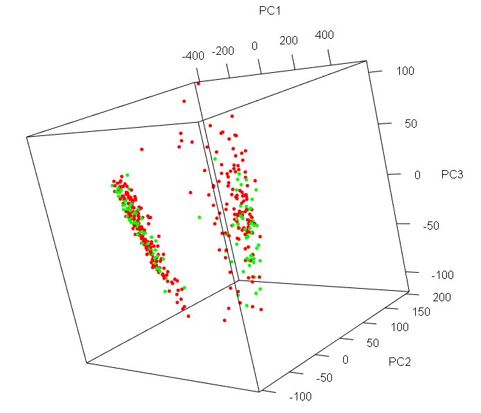

## Contributors:

- Roudy Bou Francis
- Rayane Adam

## Data loading and preprocessing

Main packages used in this project:


<!-- this code is silent and will be seen just for us to install the packages-->


```
## Warning: package 'gtools' was built under R version 4.3.2
```


Data in this project is accessed from the [GEO database](https://www.ncbi.nlm.nih.gov/geo/). The dataset used is [GSE231409](https://www.ncbi.nlm.nih.gov/geo/query/acc.cgi?acc=GSE231409) which contains RNA-Seq data from 455 patients testing for COVID-19 [[1](#refrences)]. The data is downloaded from the GEO database and saved as a `.csv` file (you can download it gunzipped by clicking on [THIS](https://www.ncbi.nlm.nih.gov/geo/download/?acc=GSE231409&format=file&file=GSE231409%5FBRAVE%5FRNASeq%5Fcounts%2Ecsv%2Egz). The metadata is accessed directly within the code from the GEO database and saved as a data frame via `GEOquery` package. The data is then standardized. The standardized data is then cleaned and preprocessed using `dplyr` and `tibble` packages, and the gene names were accessed from the ENSEMBL accession numbers via `biomaRt` package. 

**What's the data?**  
The data is a matrix of 455 samples and 60675 genes. The samples are from patients who were tested for COVID-19. It has been experimentally collected and published in the GEO database and it representes RNA-seq raw counts data.  

**What's gene expresion data?**  
Gene expression is the process by which information from a gene is used in the synthesis of a functional gene product. These products are often proteins, but in non-protein coding genes such as transfer RNA (tRNA) or small nuclear RNA (snRNA) genes, the product is a functional RNA. 
RNA-seq is a technique used to measure gene expression levels. It is used to compare gene expression levels between different samples.  [source: Wikipedia](https://en.wikipedia.org/wiki/Gene_expression).  

**Why standardize?**   
The data consists of RNA-seq counts, which are not normalized. The counts are affected by external factors. Therefore, we need to normalize the data to make it comparable between samples. Now not only we need to normalize, but we also need to standardize the data. Standardization is a scaling technique where the values are centered around the mean with a unit standard deviation. This is done to make the data comparable between features. This is particularly important in our case since we have a lot of features (genes) and we want to apply _Principal Component Analysis_ (PCA) to reduce the dimensionality of the data. PCA is sensitive to the scale of the data, so we need to standardize the data before applying PCA.


**Why the project?**  
In this phase, we will extend our phase 2 work and perform classification on the data using Decision Trees. The binary classification problem is a predicion whether one has COVID-19 or not based on their gene expression levels. We will be performing a _Dimensionality Reduction_ technique (PCA) in order to reduce the number of features (genes) and then perform classification on the data, it use is common in practice when dealing with gene expression data. [[2](#references)]


### Loading the data

The csv file can be accessed and directly downloaded [here](https://www.ncbi.nlm.nih.gov/geo/download/?acc=GSE231409&format=file&file=GSE231409%5FBRAVE%5FRNASeq%5Fcounts%2Ecsv%2Egz). The metadata is accessed directly from the GEO database using the `GEOquery` package on accession number `GSE231409`. It comprises informatio related to samples subjects, ids, tissue, covid status...etc. Out of them all we're interested in taking the sample ids (GSM instead of having titles) and the covid status which is our response y (a case of binary classification, yes/no).


```r
library(tidyverse) #data anlaysis
```

```
## Warning: package 'tidyverse' was built under R version 4.3.2
```

```
## Warning: package 'ggplot2' was built under R version 4.3.2
```

```
## Warning: package 'tibble' was built under R version 4.3.2
```

```
## Warning: package 'tidyr' was built under R version 4.3.2
```

```
## Warning: package 'readr' was built under R version 4.3.2
```

```
## Warning: package 'dplyr' was built under R version 4.3.2
```

```
## Warning: package 'forcats' was built under R version 4.3.2
```

```
## Warning: package 'lubridate' was built under R version 4.3.2
```

```r
library(GEOquery) #connecion to GEO data
library(biomaRt) #connection to ensembl
```

```
## Warning: package 'biomaRt' was built under R version 4.3.2
```

```r
library(edgeR) #normalize seq counts -- will standardize instead
```

```
## Warning: package 'edgeR' was built under R version 4.3.2
```

```r
library(pROC) #plot the roc curve
```

```
## Warning: package 'pROC' was built under R version 4.3.2
```

```r
library(caret) #for cv
```

```
## Warning: package 'caret' was built under R version 4.3.2
```

```r
#library(rgl) #for 3d plots of pca
library(tree) #for tree based methods
```

```
## Warning: package 'tree' was built under R version 4.3.2
```

```r
library(dplyr)
#install.packages("caTools")
#library("caTools")


#loading data accessed from GEO
gene_exp <- read.csv("../data/GSE231409_BRAVE_RNASeq_counts.csv")
rownames(gene_exp) <- gene_exp$target_id
gene_exp <- gene_exp %>%
  dplyr::select(-target_id)

#loading the metadata from GEO directly
gse <- getGEO("GSE231409", GSEMatrix =TRUE, getGPL=FALSE)
metadata <- pData(gse[[1]])

get_stat <- function(df) {
  cat("1st 5 columns:", head(colnames(df), n = 5), "\n")
  cat("1st 5 rows:", head(rownames(df), n = 5), "\n")
}
get_sample <- function(df){
  submatrix <- df[1:3, 1:3]
  print(submatrix)
}

##get_stat(gene_exp)
get_sample(gene_exp)
```

```
##                   X025CBE.M0.PAX X0719FA.M0.PAX X0BF51C.M0.PAX
## ENSG00000290825.1             25             80              0
## ENSG00000223972.6              0              0              0
## ENSG00000227232.5            987            792           2424
```

### Preprocessing: Standardization

We will perform data standardization by using the `scale` function. This will center the data around the mean and scale it to have a unit standard deviation. This is done to make the data comparable between features. It's particularly important in our case since we have a lot of features (genes) and we want to apply _Principal Component Analysis_ (PCA) to reduce the dimensionality of the data. PCA is sensitive to the scale of the data, so we need to standardize the data before applying PCA. So data standardization basically involves converting each original value into a `z-score`.


```r
gene_exp <- scale(gene_exp) %>%
  as.data.frame()
get_sample(gene_exp)
```

```
##                   X025CBE.M0.PAX X0719FA.M0.PAX X0BF51C.M0.PAX
## ENSG00000290825.1    -0.07948671   -0.102489369     -0.1080469
## ENSG00000223972.6    -0.08421531   -0.113006065     -0.1080469
## ENSG00000227232.5     0.10246974   -0.008890776      0.1973891
```


Now notice that the gene names are encoded by ENSEMBL accession numbers, we will connect to the database via biomaRt and change them to gene names.  
Steps to follow: 
- get the list of ensembl ids (trimmed the numbers after . since these refer to transcript variants and do all ebling to the same ensembl id, in order to access it properly from the database had to make it represent a non . number)
- connect to the database
- retrieve the gene names for the ensembl ids
- replace the ensembl ids by gene names in the data frame

**p.s.** when retrieving the gene names, some of the ENSEMBL ids do not link to a gene name, so we remove those rows from the data frame. These can be associated to any of the following:  

- Unannotated Genes
- Novel Genes
- Pseudogenes
- Non-Coding RNAs
- Temporary IDs  

In all cases, they won't be useful for our analysis to make inferences so we remove them

### Preprocessing: Data Cleaning


```r
#removing the .* from the ensemble ids
gene_exp <- gene_exp %>% 
  rownames_to_column(var = "ens_accession") %>%
  rename(ensembl_gene_id = ens_accession) #we're in the process of changing the rownames

gene_exp$ensembl_gene_id <- sub("\\..*", "", gene_exp$ensembl_gene_id) 

#removing duplicaes entries of endembl ids in the gene_exp table
gene_exp <- gene_exp[!duplicated(gene_exp$ensembl_gene_id),]

ensembl_ids <- gene_exp$ensembl_gene_id #used to access gene naems from ensembl
ensembl <- useEnsembl(biomart = "genes") #choosing the database genes 
connect <- useMart("ensembl", dataset = "hsapiens_gene_ensembl") 
#building a connection with ensembl to the database for human genes


gene_names <- getBM(attributes = c("ensembl_gene_id","external_gene_name"), 
                    filters ="ensembl_gene_id", 
                    values = ensembl_ids, 
                    mart = connect)
gene_names$ensembl_gene_id <- as.character(gene_names$ensembl_gene_id)
gene_names$external_gene_name <- as.character(gene_names$external_gene_name)


#wanna get the list of ensembl ids that are not in gene_names
ensembl_ids_not_in_gene_names <- setdiff(ensembl_ids, gene_names$ensembl_gene_id)


#join tables and remove the ids that do not map to gene names
gene_exp <- merge(gene_exp, gene_names, by = "ensembl_gene_id", all.x = TRUE)
gene_exp <- gene_exp %>% 
  filter(!is.na(gene_exp$external_gene_name))

#adding a prefix to duplicate external_gene_name
gene_exp <- gene_exp %>%
  mutate(external_gene_name = ifelse(duplicated(external_gene_name), 
                                     paste(external_gene_name, row_number(), sep = "_"), 
                                     external_gene_name))


rownames(gene_exp) <- gene_exp$external_gene_name
gene_exp <- gene_exp[,-1] %>%
  dplyr::select(-external_gene_name)

#get_stat(gene_exp)
get_sample(gene_exp)
```

```
##        X025CBE.M0.PAX X0719FA.M0.PAX X0BF51C.M0.PAX
## TSPAN6    -0.08421531    -0.11103418    -0.10804695
## TNMD      -0.08421531    -0.11300607    -0.10804695
## DPM1       0.01205895     0.07905509    -0.01165313
```

The data so far has samples as columns and genes as rows. Performing a supervised learning approach, we intend to predict the covid status of a patient based on their gene expression levels. Therefore, we need to transpose the data so that the samples are rows and genes are columns, since genes are the features. The response variable is the covid status of the patient. The data is then joined with the metadata to add the covid status to the data frame. The covid status is then converted to a factor variable with levels `Yes` and `No`, and we removed the ones that we don't know their status (NA).


```r
gene_exp <- t(gene_exp) %>%
  as.data.frame()

#get_stat(gene_exp)
get_sample(gene_exp)
```

```
##                     TSPAN6        TNMD        DPM1
## X025CBE.M0.PAX -0.08421531 -0.08421531  0.01205895
## X0719FA.M0.PAX -0.11103418 -0.11300607  0.07905509
## X0BF51C.M0.PAX -0.10804695 -0.10804695 -0.01165313
```


```r
#get the labels of the metadata in a separate column: data frame contains title, accession number and covid result
response <- metadata %>%
  dplyr::select(1,16) %>%
  rename(covid = characteristics_ch1.6) %>%
  mutate(covid = gsub("covid: ", "" ,covid))

gene_exp <- gene_exp %>%
  rownames_to_column(var = "title") %>% #convert the row names into a column
  left_join(., response, by = "title")  
rownames(gene_exp) <- gene_exp$title
gene_exp <- gene_exp[,-1]

gene_exp <- gene_exp[!is.na(gene_exp$covid), ] #to remove unlabeled samples, NA as response
```


```r
gene_exp$covid <- factor(gene_exp$covid, labels=c("No","Yes"))

covid_counts <- gene_exp %>%
  group_by(covid) %>%
  summarise(count = n())

gene_exp %>%
  dplyr::count(covid)
```

```
##   covid   n
## 1    No 120
## 2   Yes 297
```

```r
ggplot(covid_counts, aes(x = covid, y = count, fill=covid)) +
  geom_bar(stat = "identity") +
  xlab("Has COVID") +
  ylab("Count") +
  ggtitle("Classes Distribution")
```

<!-- --> 

There is a slight imbalance between classes as can be seen in the histogram above.


```r
cat("number of rows:",nrow(gene_exp),"; number of columns:",ncol(gene_exp))
```

```
## number of rows: 417 ; number of columns: 62606
```

We have now `417` samples and `62639` genes in the data frame, along with a column for labels.

So to sum it up, this dataset comprises:

- large number of features (62640)
- small number of samples (417)
- class imbalance (120 vs 297)

The large number of features will be handled by applying PCA ~Later on  
To solve the the problem of the smmall number of samples and class imbalance, some *oversampling* methods should be considered in the future as an extension to this project. [[3](#references)]

### Dimensionality Reduction

Now we will apply PCA to reduce the dimensionality of the data. We will use the `prcomp` function. PCA is applied as one of the preprocessing steps because our data consists of a very large number of features (62640) and dimensionality reduction is a must.


```r
pca <- prcomp(gene_exp[,-ncol(gene_exp)], center = TRUE, scale = TRUE) 

#now the pca object contains the principal components, this is a sample of the 1st 4
scores = as.data.frame(pca$x)
head(scores[1:4])
```

```
##                     PC1       PC2       PC3        PC4
## A8FD53.M0.PAX -93.33514 -55.04541 21.714790 -38.241978
## A97D5B.M0.PAX 195.51760 -98.98766 30.600480   8.657920
## AB9A75.M0.PAX  17.15237 -87.46782 53.582838  -5.280783
## ABD53F.M0.PAX  32.86909 -79.07476 34.714763 -24.841593
## AC9270.M0.NSB 280.52083  36.23184 -7.938806   8.503444
## AC9270.M0.PAX -94.80146 -51.45452  1.873177 -50.281657
```
Our PCA is performed using the function 'prcomp()' and it centers the variables to have mean zero (center = TRUE) and we additionally sclae the variables to have standard deviation one (scale = TRUE).


```r
#names(pca)
```

Now this is a 2d plot of the 1st 2 principal components.


```r
colors <- ifelse(gene_exp$covid == "Yes", "red", "green")

#plotting the 1st 2 principal components
plot(pca$x[,1], pca$x[,2], col = colors, pch = 20, xlab = "PC1", ylab = "PC2")
```

<!-- --> 

It can be clearly seen that the data points are not truly seperable so we will try having the 1st 3 components.  

This is a 3d plot for PC3 and PC4:


```r
plot(pca$x[,3], pca$x[,4], col = colors, pch=20, xlab = "PC3", ylab = "PC4")
```

<!-- --> 
They are not seperable at all.


We will plot the variance explained by each principal component. 


```r
par (mfrow=c(1,2))
pve <- pca$sdev^2/sum(pca$sdev^2)

distances <- abs((length(pve):1) - pve)
elbow_point <- which.max(distances)

plot(pve, type = "o", ylab = "PVE",
    xlab = "Principal Component", col = "#87CEEB", xlim = c(0, length(pve)+1), pch=20)

#cumulative proportion of variance explained
plot(cumsum(pve), type = "o", ylab = "Cumulative PVE",
    xlab = "Principal Component", col = "#FFDAB9", xlim = c(0, length(pve)+1), pch=20)
```

<!-- --> 


```r
pca_summary <- summary(pca)
pve_table <- data.frame(
  PVE = pca_summary$importance[2, 1:4],
  cumulative_PVE = pca_summary$importance[3, 1:4]
)

pve_table
```

```
##         PVE cumulative_PVE
## PC1 0.83606        0.83606
## PC2 0.05028        0.88634
## PC3 0.02056        0.90690
## PC4 0.01007        0.91697
```

As we can see, most of the variance explained are exlained via PC1, this is why we will use the 1st principal component for gene selection (highest variance)

Now a 3d plot of the PC1, PC2 and PC3 using `rgl` package ([source](https://statisticsglobe.com/3d-plot-pca-r#:~:text=scores%20in%203D!-,Example%201%3A%20Plot%20PCA%20in%203D,to%20label%20the%20car%20models.)): 


```r
#plot the 3D scatter plot colored by covid - used rgl lib
#plot3d(scores[,1:3], 
 #      size=5,
  #     col = colors)
```


<p align="center">
  
</p>

As can be seen (in figure 2) even the 3d plot did not seperate the data well.

Now, let us visualize the scree plot of the PCA that was performed.


```r
screeplot(pca, type="l", main=NULL)
```

<!-- --> 
Based on the scree plot, we should take 2 PCs components.Because PC1 and PC2 explains most of the variability 

In this phase, we will deal with the tree based approaches and with some unsupervised techniques. We should use the features denoted by PCA, this is why, we should transform the PCs into actual features to be able to use them in the trees approaches. In addition, we're gonna use feature selection and perform the same tree approaches. Both results are going to be compared, to know if PCA is actually useful in our specific data set or not. The decision to use PCA or not should depend on the specific characteristics of our dataset and the trade-offs between dimensionality reduction and interpretability. It's often a good practice to compare different approaches and assess their impact on the required task before deciding whether to use PCA or rely on the original features.*~ that's what we will be doing. Stay excited!!*

## First, let's transform the data:


```r
#pcs <- pca$x
#num_pcs_to_use <- 2
#selected_pcs <- pcs[, 1:num_pcs_to_use]
#gene_names_contributing_to_PC <- gene_names[order(abs(selected_pcs[, 1]), decreasing = TRUE)[1:10]]
#gene_names_contributing_to_PC
```

We commented this code chunk for knitting purposes, however, we were able from it to extract 10 most variable genes from pc1, and they are:  *AKAP8L , MAPK8IP2 , BLTP2, ANGEL1 , LUC7L, ATP1A2, PPP5C, HEATR5B, KLHL13, CRY1*

Now we have 10 genes that we can work with, these 10 genes were extracted from PCA. Preprocessing (including PCA) is officially done now.
Let's move now to the tree based approaches.


## Tree-based approaches

Here, we will be applying classification using tree-based algorithms on the **transformed dataset**, including:  

- Decision Trees
- Random Forests
- Bagging
- Boosting

*Let's go!!*


```r
# that is the function we are going to use in order to split our data using validation set
split_data <- function(df, p=0.7) {
  #this function takes a data frame and proportion of split and splits it to training and testing - if proportion not provided ir'll assume it is 0.7
  df <- df %>%
    mutate(id=row_number())
  
  tr <- df %>%
    slice_sample(prop=p)
  te <- anti_join(df, tr, by='id')
  
  tr <- tr %>% dplyr::select(-id)
  te <- te %>% dplyr::select(-id)
  
  return (list(train = tr, test = te))
}
```


```r
set.seed(42)
my_split <- split_data(gene_exp, 0.8)
train_set <- my_split$train
test_set <- my_split$test
```


### Decision Tree


```r
tree_model <- tree( covid ~ AKAP8L + MAPK8IP2 + BLTP2+ ANGEL1 + LUC7L+ ATP1A2+ PPP5C+ HEATR5B+ KLHL13+ CRY1, data = train_set)
summary(tree_model)
```

```
## 
## Classification tree:
## tree(formula = covid ~ AKAP8L + MAPK8IP2 + BLTP2 + ANGEL1 + LUC7L + 
##     ATP1A2 + PPP5C + HEATR5B + KLHL13 + CRY1, data = train_set)
## Variables actually used in tree construction:
## [1] "PPP5C"   "CRY1"    "HEATR5B" "LUC7L"   "KLHL13"  "AKAP8L"  "ANGEL1" 
## [8] "BLTP2"  
## Number of terminal nodes:  29 
## Residual mean deviance:  0.6545 = 199 / 304 
## Misclassification error rate: 0.1682 = 56 / 333
```
We can see that the training error is 0.1682 = 16.82 %

One of the most attractive properties of trees is that they can be graphically displayed. We use the plot() function to display the tree structure, and the text() function to display the node labels.


```r
# Plot the decision tree with adjusted parameters
plot(tree_model)  # Adjust values as needed
text(tree_model, pretty = 0, cex = 0.4)
```

<!-- --> 
This is the plot of the tree that we have, we tried as much as possible to make it clear.
Now that we performed decision trees approach on our training data, let's predict its performance on our testing data.
And after predicting, let's check the accuracy of this prediction.


```r
test_set$pred <- predict(tree_model, test_set, type = "class")
tree_accuracy <- mean(test_set$pred == test_set$covid)
tree_accuracy
```

```
## [1] 0.6785714
```

The accuracy is 0.6785714 (or approximately 67.85%) in the prediction on the tree model and this suggests that out of the test data used, about 67.85% of the cases were correctly classified by the decision tree model. 
*That is a good number of correct classifications*

Now after computing the decision tree and plotting it, let's move to the random forest.

### Random Forest

We are going first to apply random forest on the training data that we have and then we are going to predict on the new unseen testing data. In addition, we are going to look at the accuracy.

*Why did the random forest throw a party? Because it wanted to "branch" out and celebrate its diverse predictions!  haha just kidding!!*


```r
#install.packages("randomForest")
library(randomForest)
```

```
## Warning: package 'randomForest' was built under R version 4.3.2
```

```
## randomForest 4.7-1.1
```

```
## Type rfNews() to see new features/changes/bug fixes.
```

```
## 
## Attaching package: 'randomForest'
```

```
## The following object is masked from 'package:Biobase':
## 
##     combine
```

```
## The following object is masked from 'package:BiocGenerics':
## 
##     combine
```

```
## The following object is masked from 'package:dplyr':
## 
##     combine
```

```
## The following object is masked from 'package:ggplot2':
## 
##     margin
```

```r
set.seed(123)
#max_mtry <- floor(sqrt(ncol(train_set) - 1))
test_set <- test_set[complete.cases(test_set$covid), ]
train_set <- train_set[complete.cases(train_set$covid), ]
rf <- randomForest(formula = covid ~ AKAP8L + MAPK8IP2 + BLTP2+ ANGEL1 + LUC7L+ ATP1A2+ PPP5C+ HEATR5B+ KLHL13+ CRY1, data = train_set, mtry = sqrt(ncol(train_set) - 1), importance = T, ntree=1000)
```

```
## Warning in randomForest.default(m, y, ...): invalid mtry: reset to within valid
## range
```

```r
#test_set <- test_set[complete.cases(test_set$covid), ]
#pred_rf <- predict(rf, newdata = test_set)
#rf_accuracy <- mean(pred_rf == as.character(test_set$covid))
pred_rf = predict(rf, newdata = test_set)
rf_accuracy <- mean(pred_rf == test_set$covid)
rf_accuracy
```

```
## [1] 0.7619048
```

The accuracy is 0.7619048 (or approximately 76.19%) in the prediction on the tree model and this suggests that out of the test data used, about 76.19% of the cases were correctly classified by the decision tree model.

## Bagging

Now, we are going to apply bagging on our training data that we have and then we are going to predict on the new unseen testing data. In addition, we are going to look at the accuracy.


```r
set.seed(123)
bag <- randomForest(formula=covid ~ AKAP8L + MAPK8IP2 + BLTP2+ ANGEL1 + LUC7L+ ATP1A2+ PPP5C+ HEATR5B+ KLHL13+ CRY1, data = train_set, mtry=(ncol(train_set)-1),importance=T, ntree=1000)
```

```
## Warning in randomForest.default(m, y, ...): invalid mtry: reset to within valid
## range
```

```r
bag
```

```
## 
## Call:
##  randomForest(formula = covid ~ AKAP8L + MAPK8IP2 + BLTP2 + ANGEL1 +      LUC7L + ATP1A2 + PPP5C + HEATR5B + KLHL13 + CRY1, data = train_set,      mtry = (ncol(train_set) - 1), importance = T, ntree = 1000) 
##                Type of random forest: classification
##                      Number of trees: 1000
## No. of variables tried at each split: 10
## 
##         OOB estimate of  error rate: 30.03%
## Confusion matrix:
##     No Yes class.error
## No  21  76   0.7835052
## Yes 24 212   0.1016949
```

```r
pred_bag <- predict(object=bag, newdata= test_set, type="class")
table(test_set$covid, pred_bag)
```

```
##      pred_bag
##       No Yes
##   No   6  17
##   Yes  3  58
```

```r
bag_accuracy <- mean(test_set$covid==pred_bag)
bag_accuracy
```

```
## [1] 0.7619048
```

The accuracy of the bagging is 0.7619048 (or approximately 76.19%) in the prediction on the tree model and this suggests that out of the test data used, about 76.19% of the cases were correctly classified by the decision tree model.

The accuracy of bagging is similar to the accuracy of random forest.

## Boosting

Till now we performed random forest and bagging on our training data, and we predicted on the unseen testing data. We also compared the accuracy of both. To make our phase 3 more challenging and beautifu, we will proceed by doing boosting on our training data and then predicting on the testing data. The accuracy of the 3 approaches: random forest, boosting and bagging will be compared in order to reach a small conclusion about the best tree approach based on our specific data set.


```r
library(gbm)
```

```
## Warning: package 'gbm' was built under R version 4.3.2
```

```
## Loaded gbm 2.1.9
```

```
## This version of gbm is no longer under development. Consider transitioning to gbm3, https://github.com/gbm-developers/gbm3
```

```r
set.seed(1)
boost = gbm(covid ~ AKAP8L + MAPK8IP2 + BLTP2+ ANGEL1 + LUC7L+ ATP1A2+ PPP5C+ HEATR5B+ KLHL13+ CRY1, data = train_set, distribution = "gaussian", n.trees = 5000, interaction.depth = 4)
```


```r
summary(boost)
```

<!-- --> 

```
##               var   rel.inf
## CRY1         CRY1 12.493349
## PPP5C       PPP5C 11.822115
## ANGEL1     ANGEL1 11.422470
## HEATR5B   HEATR5B 10.775913
## BLTP2       BLTP2  9.920749
## LUC7L       LUC7L  9.599388
## AKAP8L     AKAP8L  8.949579
## MAPK8IP2 MAPK8IP2  8.534374
## KLHL13     KLHL13  8.314011
## ATP1A2     ATP1A2  8.168051
```

We notice that *CRY1* is by far the most important variables.
That' why we should plot them.


```r
par(mfrow = c(1,2))
plot(boost, i = "CRY1")
```

<!-- --> 

We now use the boosted model to predict covid on the test data set:


```r
boost_pred = predict(boost, newdata = test_set, n.trees = 5000)
table <- table(boost_pred, test_set$covid)
table
```

```
##                    
## boost_pred          No Yes
##   0.993809311745261  1   0
##   1.04753325050906   1   0
##   1.06463211594272   1   0
##   1.10828923744334   1   0
##   1.12772847629026   1   0
##   1.23490537189112   0   1
##   1.26234496576493   0   1
##   1.28631045993804   0   1
##   1.29875654242201   0   1
##   1.30874101462193   0   1
##   1.32545123196683   1   0
##   1.32775626664727   0   1
##   1.33460371522616   0   1
##   1.34660918057046   0   1
##   1.36171002425509   0   1
##   1.36298751820163   0   1
##   1.37300274051782   0   1
##   1.3811747221684    0   1
##   1.43069415519504   0   1
##   1.43262083707543   0   1
##   1.43359698571205   1   0
##   1.43653505038014   0   1
##   1.444583246824     1   0
##   1.44908824153218   1   0
##   1.45480248114539   1   0
##   1.47637849316531   0   1
##   1.51793144766442   0   1
##   1.5507069273472    0   1
##   1.55618388065138   0   1
##   1.58577276669816   1   0
##   1.59495720340467   0   1
##   1.61921191957834   0   1
##   1.62513796481979   0   1
##   1.64500168612349   0   1
##   1.67105418585137   0   1
##   1.67288679981764   0   1
##   1.68099590313065   0   1
##   1.69706646921309   0   1
##   1.70128108679751   0   1
##   1.70633429045333   0   1
##   1.71025504199067   0   1
##   1.72171739829391   0   1
##   1.72314363795305   1   0
##   1.72932275035347   0   1
##   1.74852667082424   0   1
##   1.75998380349037   0   1
##   1.7685439742967    1   0
##   1.77991223407782   1   0
##   1.7830187906628    1   0
##   1.79489512280236   0   1
##   1.79997410030219   0   1
##   1.80192189198541   0   1
##   1.81206999767142   0   1
##   1.83334880875367   0   1
##   1.84159774958926   0   1
##   1.84657870290822   1   0
##   1.86529204431008   1   0
##   1.86588898980158   0   1
##   1.86795998691688   1   0
##   1.86839293438705   0   1
##   1.87754891817035   0   1
##   1.8833145737461    1   0
##   1.8875517459868    1   0
##   1.89144476799176   0   1
##   1.89442324881645   0   1
##   1.89672664707847   0   1
##   1.91139839081321   0   1
##   1.92636965499998   0   1
##   1.93790088213063   0   1
##   1.95783034821949   0   1
##   1.95938410443459   0   1
##   1.966920293388     1   0
##   1.98103332966686   0   1
##   1.98195660308295   0   1
##   1.98984564556791   0   1
##   1.99693517298867   0   1
##   2.10517376391356   0   1
##   2.11374164122436   0   1
##   2.1205540281339    0   1
##   2.16457793658494   1   0
##   2.23603063529611   0   1
##   2.24229685823146   0   1
##   2.26106050615923   0   1
##   2.33806151397641   1   0
```

```r
boost_acc <- mean(test_set$covid==boost_pred)
#boost_acc
```

It gave boosting accuracy of 0.66357, which is not better than before. 
The default value of the shrinkage parameter λ is 0.001, but this value can be easily modified. If we want to, we can perform boosting with a different value of the shrinkage parameter λ. In the following boosting we take λ = 0.2.


```r
set.seed(142)
boost1 = gbm(covid ~ AKAP8L + MAPK8IP2 + BLTP2+ ANGEL1 + LUC7L+ ATP1A2+ PPP5C+ HEATR5B+ KLHL13+ CRY1, data = train_set, distribution = "gaussian", n.trees = 5000, interaction.depth = 4, shrinkage = 0.2, verbose = F)
boost_pred1 = predict(boost1, newdata = test_set, n.trees = 5000)
table <- table(boost_pred1, test_set$covid)
table
```

```
##                    
## boost_pred1         No Yes
##   0.829801659334307  1   0
##   1.00079076146476   1   0
##   1.02656530923569   1   0
##   1.06685638496039   0   1
##   1.16497441303241   0   1
##   1.20092707137335   1   0
##   1.22696141297003   0   1
##   1.25356535044801   0   1
##   1.30664304421431   0   1
##   1.3159097358688    0   1
##   1.32403548564743   0   1
##   1.33356466505765   1   0
##   1.33990064838721   0   1
##   1.35510178779965   0   1
##   1.3748187116788    0   1
##   1.37617002281812   0   1
##   1.37666527322012   0   1
##   1.40085187812076   0   1
##   1.40454156249761   0   1
##   1.42198509043893   1   0
##   1.44213030829951   0   1
##   1.44614434909965   0   1
##   1.45029853986047   0   1
##   1.45549000553432   1   0
##   1.4672454847752    1   0
##   1.47184982574619   0   1
##   1.47761381030358   0   1
##   1.492362713019     0   1
##   1.53366643832366   0   1
##   1.54533764236123   0   1
##   1.55408551822616   1   0
##   1.55470367732045   0   1
##   1.55559530468333   0   1
##   1.55584335343475   0   1
##   1.56524147641109   1   0
##   1.59013475385237   0   1
##   1.61734049533141   0   1
##   1.61798978645777   1   0
##   1.62327994505748   0   1
##   1.63516905862331   1   0
##   1.64891580513345   0   1
##   1.66158698598273   0   1
##   1.66589807604844   0   1
##   1.66782793936916   0   1
##   1.66966234175222   0   1
##   1.68643918836083   0   1
##   1.71327331123488   0   1
##   1.73787123033789   1   0
##   1.73958149561401   0   1
##   1.74532089115797   0   1
##   1.74585675072675   0   1
##   1.74875840843922   1   0
##   1.76668881522098   0   1
##   1.78502244037842   0   1
##   1.79590932873857   1   0
##   1.82567983559646   1   0
##   1.83316056863949   0   1
##   1.83660638236224   0   1
##   1.84164704446298   0   1
##   1.84790107203722   0   1
##   1.85276593126416   1   0
##   1.85649434335764   0   1
##   1.87022274848195   0   1
##   1.87230918176209   1   0
##   1.87628168735375   0   1
##   1.89554129532909   0   1
##   1.89583490782961   0   1
##   1.90614684595483   0   1
##   1.91282327160461   1   0
##   1.92001152346641   0   1
##   1.92117702643443   0   1
##   1.92338527262403   0   1
##   1.94626171058522   1   0
##   1.98782829637444   0   1
##   2.00762017771054   0   1
##   2.02327798768226   0   1
##   2.06240948561523   0   1
##   2.08037436618173   1   0
##   2.08320902564972   0   1
##   2.09087879794388   1   0
##   2.10533855258512   1   0
##   2.2009812376804    0   1
##   2.22881076744207   0   1
##   2.29363663611501   0   1
```

```r
boost_acc <- mean(test_set$covid==boost_pred1)
#boost_acc
```

After shrinkage it became 0.678 which is better than the latter shrinkage of 0.01

*Once the issue is fixed, compare both models with different lambdas*

## Clustering

Now, we finished the supervised techniques in our phase, and we want to move now to do the unsupervised techniques.
Here, we will be applying clustering using (we already applied PCA as a preprocessing step in the [Dimensionality Reduction section (link))](#dimensionality-reduction):  

- K-means
- Hierarchical clustering

According to [[2](#references)], the transformed data (after applying PCA) will not necessarilly be clustered as good as the original one (with its full dimensions). In this project we would like to take that further and study this hypothesis: 

We will try clustering on both datasets (transformed and non transformed) and compare results.

<!-- ask roudy about it-->
We will start by k-means and we will perform it using k = 2 at first.


```r
set.seed(123)
gene_exp <- matrix(rnorm(1000), ncol = 10)
gene_exp[sample(length(gene_exp), 10)] <- NaN

# Check for missing or extreme values
any(is.na(gene_exp))  # Check for missing values
```

```
## [1] TRUE
```

```r
any(is.infinite(gene_exp) | is.nan(gene_exp))  # Check for infinite or NaN values
```

```
## [1] TRUE
```

```r
# if we don't handle these missing or extreme values, the k means will not work correctly
# Handle missing or extreme values
gene_exp[is.na(gene_exp)] <- 0  # Replace NA with 0
gene_exp[is.infinite(gene_exp) | is.nan(gene_exp)] <- 0  # Replace Inf/NaN with 0
k <- 2
kmeans_result <- kmeans(gene_exp, centers = k)
cluster_assignments <- kmeans_result$cluster
print(cluster_assignments)
```

```
##   [1] 1 1 1 1 1 2 1 1 2 2 2 2 1 1 2 2 2 1 2 2 1 1 1 1 1 2 1 2 1 2 2 1 1 2 1 1 1
##  [38] 1 2 2 2 2 2 2 1 1 2 1 2 2 2 1 1 2 1 2 2 2 1 2 2 2 2 1 2 1 2 1 2 2 1 1 2 1
##  [75] 2 1 1 1 1 1 2 2 1 1 1 1 2 1 1 2 2 1 2 1 1 2 2 2 1 1
```
Now we obtained the k means clusters, and now to visualize the results of k-means clustering, we should plot the clusters along with their centroids.


```r
plot(gene_exp[,1], gene_exp[,2], col = cluster_assignments, 
     pch = 19, xlab = "Gene 1", ylab = "Gene 2")
points(kmeans_result$centers[,1], kmeans_result$centers[,2], col = 1:k, pch = 8, cex = 3)
```

<!-- --> 

The centroids are very close together, and the 2 clusters are not separable. Actually, we need more iterations to be able to separate the clusters more and for the centroids to be able to be far away.

Now we are going to perform hierarchical clustering.


```r
set.seed(123)
gene_exp <- matrix(rnorm(1000), ncol = 10)  
hc <- hclust(dist(gene_exp))  
# Plotting the dendrogram
plot(hc, main = "Hierarchical Clustering Dendrogram", xlab = "Samples", sub = NULL)
```

<!-- --> 

After performing the hierarchical clustering, we obtained the dendogram above. Now let's go and try all the four linkage: complete, single, average, centroid, ward.D2.


```r
set.seed(1)
library(cluster)
d_manhattan <- dist(gene_exp, method = "manhattan")  # Calculating Manhattan distance

methods <- c("complete", "single", "average", "centroid", "ward.D2")
plot_titles <- c("Complete Linkage", "Single Linkage", "Average Linkage", "Centroid Linkage", "Ward.D2 Linkage")
par(mfrow = c(2, 3)) 
for (i in 1:length(methods)) {
  hc <- hclust(d_manhattan, method = methods[i])  
  
  plot(hc, main = plot_titles[i], xlab = "Samples", sub = NULL, col = rainbow(length(unique(cutree(hc, k = 3))))) 
}
```

<!-- --> 

In our data set, the ward.D2 linkage yielded the best result among them.
But still, a large number of observations are clustered in a different group as in the original data (we are facing the same issue in k-means).


## References

[1] Hurst, J. H., Mohan, A., Dalapati, T., George, I. A., Aquino, J. N., Lugo, D. J., ... & Kelly, M. S. (2023). Differential host responses within the upper respiratory tract and peripheral blood of children and adults with SARS-CoV-2 infection. medRxiv, 2023-07.

[2] Yeung, K. Y., & Ruzzo, W. L. (2001). Principal component analysis for clustering gene expression data. Bioinformatics, 17(9), 763-774.

[3] Anđelić, N., & Baressi Šegota, S. (2023). Development of Symbolic Expressions Ensemble for Breast Cancer Type Classification Using Genetic Programming Symbolic Classifier and Decision Tree Classifier. Cancers, 15(13), 3411.

_Made with love & tears & excitement for the projects to come in upcoming courses (haha not really)_

_Merry Christmas <3 (here's an implemented christmas tree just for you :)_


```r
#########code from https://towardsdatascience.com/christmas-cards-81e7e1cce21c#############

set.seed(42) # seed, so our tree is reproducible!
n_tree <- 7000
n_ornaments <- 50
dir_samples_tree <- rdirichlet(n_tree, c(1, 1, 1))
df <- data.frame("x" = dir_samples_tree[, 2] - dir_samples_tree[, 3],
                 "y" = dir_samples_tree[, 1],
                 "size" = 1,
                 "type" = "tree")
dir_samples_ornaments <- rdirichlet(n_ornaments, c(1, 1, 1))
df <- rbind(df, data.frame("x" = dir_samples_ornaments[, 2] - dir_samples_ornaments[, 3],
                           "y" = dir_samples_ornaments[, 1],
                           "size" = 2,
                           "type" = "ornaments"))
ggplot(df, aes(x=x, y=y, color = type)) +
    geom_point(aes(size=size)) +
    scale_color_manual(values = c("#CF140D", "#1A8017")) + # set colors
    theme_void() + # remove axes, labels, ticks etc.
    theme(legend.position = "none") + # remove legend
    scale_size_continuous(range = c(1.5, 8)) + # set scale for points
    ylim(0, 1.1) + xlim(-1.2, 1.2) +
    annotate("text", x = 0, y = 1.1, label = "Merry Christmas!",
             color = "#CF140D", size = 7, fontface = "bold.italic") +
    geom_text(aes(x=0, y=1), label="*", size=15, colour="#FDBA1C") # font that supports the character
```

<!-- --> 

